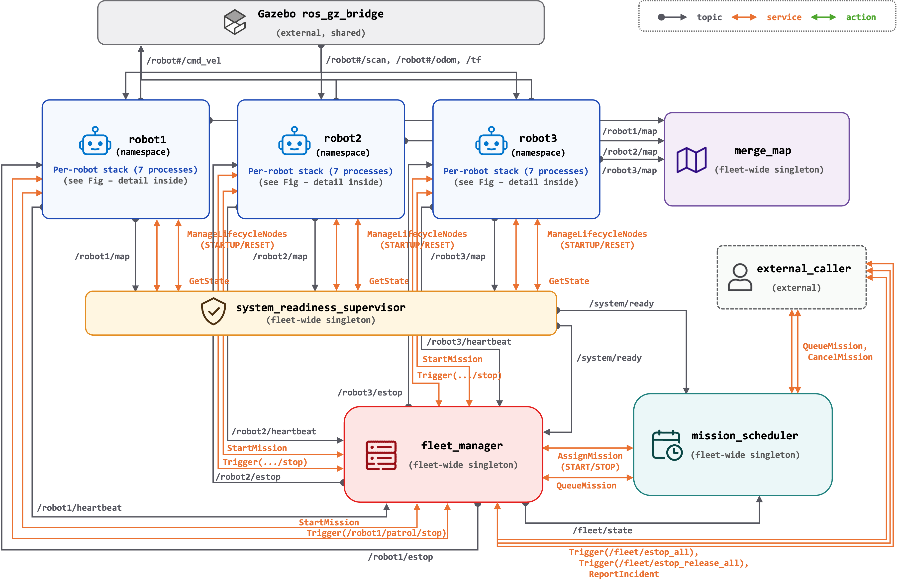
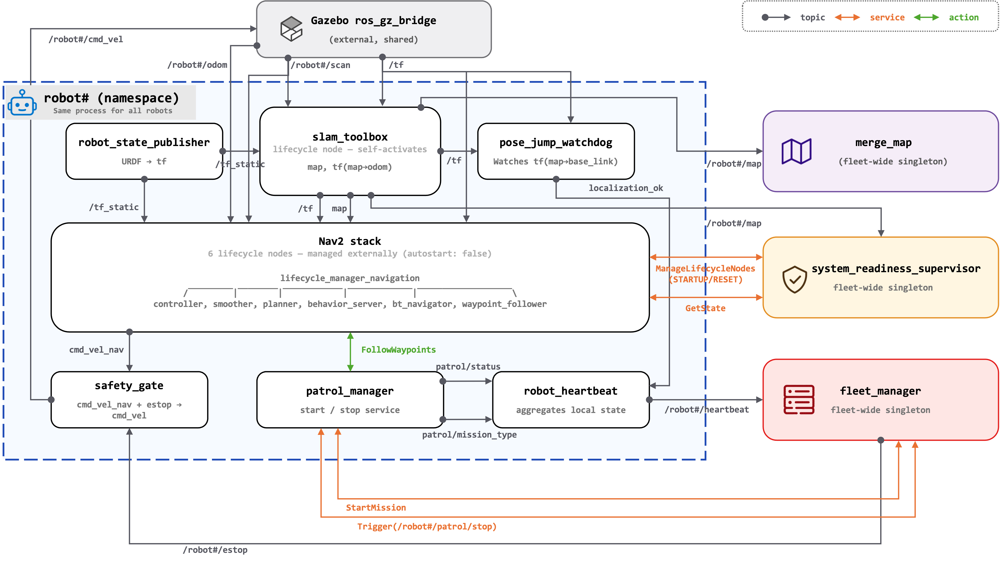
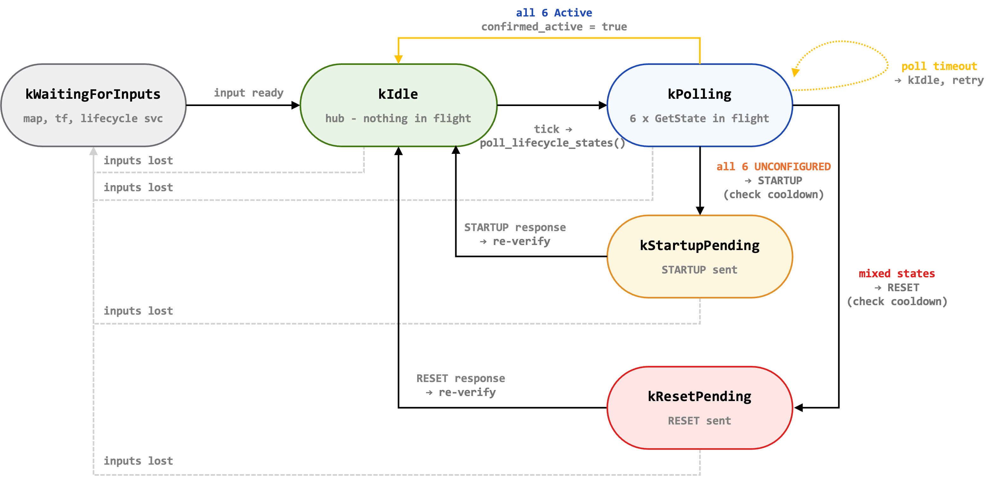
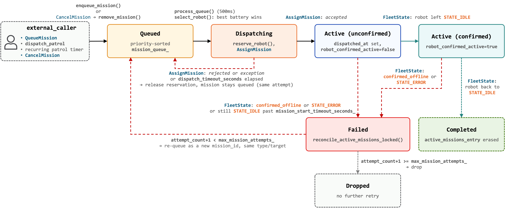

# ROS 2 Multi-Robot SLAM & Patrol Fleet

Three simulated robots (`robot1`, `robot2`, `robot3`) each run their own
SLAM and Nav2 stack in a shared Gazebo world. Once
`system_readiness_supervisor` confirms every robot's Nav2 lifecycle is
active, `mission_scheduler` starts dispatching a priority queue of patrol
missions to idle, charged robots through `fleet_manager` — which also
aggregates heartbeats, handles e-stop, and reports incidents. A
`safety_gate` node sits between Nav2 and the robot base on every robot so
e-stop works regardless of what the mission layers are doing. See
[Architecture](#architecture) below for diagrammed walkthroughs; the rest of
this README covers what each package does and how to build and run the
system.

## Architecture

**Figure 1 — System-wide topology.** Every topic, service, and action
between the 3 robots and the 4 fleet-wide singletons (`merge_map`,
`system_readiness_supervisor`, `fleet_manager`, `mission_scheduler`), plus
Gazebo and an external caller. Each robot's internals are collapsed to the
boundary detailed in Figure 2. Notice `mission_scheduler` never appears
connected to a robot directly — it only ever talks to `fleet_manager`.



**Figure 2 — Per-robot process boundary.** The 7-process stack that runs
once per robot (`robot1` shown; identical for `robot2`, `robot3`), and the
6 connections that cross the namespace boundary out to the fleet-wide
singletons and Gazebo. Everything else — SLAM feeding Nav2, patrol driving
`FollowWaypoints`, the safety gate splicing into `cmd_vel` — stays inside
one robot's namespace.



**Figure 3 — `system_readiness_supervisor` per-robot phase.** One instance
of this state machine runs per robot inside the single supervisor process.
`confirmed_active` is a sticky flag, not a phase, so a robot keeps being
re-polled forever after it's confirmed — a Nav2 node that dies later still
gets caught, and `/system/ready` can drop back to `false`.



**Figure 4 — `mission_scheduler` mission lifecycle.** One mission's path
from queue to done, retry, or drop. A dispatch that's rejected or times out
never touches `attempt_count` — only a mission that actually reached
`Active` and then failed counts toward `max_mission_attempts_`, re-enqueued
under a fresh `mission_id` each time.



## Packages

| Package | Language | Purpose |
|---|---|---|
| [bringup](src/bringup) | C++ / launch | Top-level launch orchestration; `system_readiness_supervisor` gates the rest of the stack on confirmed Nav2 lifecycle state per robot. |
| [sim](src/sim) | launch | Gazebo Harmonic simulation — spawns the fleet, bridges Gazebo↔ROS topics via `ros_gz_bridge`. |
| [description](src/description) | Xacro/URDF | Robot model (URDF, Xacro, meshes) for the `patrol_robot` platform. |
| [mapping](src/mapping) | C++ / launch | Per-robot `slam_toolbox` bringup, map-frame management, and `pose_jump_watchdog` — a cheap proxy for localization confidence that flags a teleporting `map→base_link` transform as "not ok". |
| [merge_map](src/merge_map) | Python | TF-aware online occupancy-grid merger; publishes `/merged_map` for visualization (no in-repo subscriber). Also ships an offline merge tool. |
| [navigation](src/navigation) | launch/config | Namespaced Nav2 bringup and per-robot parameter files. |
| [patrol](src/patrol) | C++ | `patrol_manager` — per-robot waypoint-loop patrol driven through Nav2's `FollowWaypoints` action, with start/stop services. |
| [fleet](src/fleet) | C++ | `fleet_manager` (heartbeat aggregation, mission dispatch, e-stop, incident reporting, SQLite-backed mission/incident log) and `robot_heartbeat` (per-robot state aggregator). |
| [scheduler](src/scheduler) | C++ | `mission_scheduler` — fleet-aware priority mission queue; reserves an idle, charged robot and hands it to `fleet_manager`. |
| [safety](src/safety) | C++ | `safety_gate` — forces `cmd_vel` to zero on e-stop, otherwise passes Nav2's `cmd_vel_nav` straight through. |
| [interfaces](src/interfaces) | msg/srv | Custom messages and services shared across the stack. |

## Custom interfaces

**Messages:** `RobotHeartbeat`, `FleetRobotState`, `FleetState`,
`MissionQueueState`, `RobotIncident`

**Services:** `QueueMission`, `CancelMission`, `AssignMission`,
`StartMission`, `ReportIncident`

Definitions live in [interfaces](src/interfaces/msg) and
support five mission types: `patrol`, `go_to`, `return_home`, `charge`,
`inspect`.

## Key topics and services

| Name | Type | Notes |
|---|---|---|
| `/system/ready` | `std_msgs/Bool` | Latched; gates the scheduler. Published by `system_readiness_supervisor` once every robot's Nav2 lifecycle nodes are confirmed `ACTIVE`. |
| `/robotN/map`, `/merged_map` | `nav_msgs/OccupancyGrid` | Per-robot SLAM output, and the visualization-only merge. |
| `/robotN/heartbeat` | `RobotHeartbeat` | Per-robot state, battery, current mission, localization health. |
| `/fleet/state` | `FleetState` | Aggregated fleet view, published by `fleet_manager`. |
| `/scheduler/queue_mission`, `/scheduler/cancel_mission` | `QueueMission`, `CancelMission` | Entry points for submitting/cancelling work. |
| `/scheduler/queue_state` | `MissionQueueState` | Latched snapshot of the pending queue. |
| `/fleet/assign_mission` | `AssignMission` | Scheduler → fleet manager dispatch (start/stop a robot on a mission). |
| `/fleet/estop_all`, `/fleet/estop_release_all` | `std_srvs/Trigger` | Fleet-wide e-stop control. |
| `/fleet/report_incident` | `ReportIncident` | Logged to SQLite; auto-dispatches a mission above a configurable severity. |
| `/robotN/patrol/start`, `/robotN/patrol/stop` | `StartMission`, `Trigger` | Per-robot mission control, called by `fleet_manager`. |

## Prerequisites

- ROS 2 (with `ament_cmake` / `ament_python`)
- Gazebo Harmonic (`ros_gz_sim`, `ros_gz_bridge`)
- Nav2 (`nav2_msgs`, `nav2_lifecycle_manager`, ...)
- `slam_toolbox`
- SQLite3 development headers (`libsqlite3-dev`) — used by `fleet`'s mission/incident store

## Build

```bash
cd ~/ros2-mutli-robot-slam
rosdep install --from-paths src --ignore-src -r -y
colcon build --symlink-install
source install/setup.bash
```

## Run

Bring up the full stack — Gazebo, safety gates, SLAM, map merge, Nav2,
patrol, scheduler, and the readiness supervisor:

```bash
ros2 launch bringup full_system.launch.py
```

Wait for `/system/ready` to latch `true` before queuing missions:

```bash
ros2 topic echo /system/ready --once
```

Queue a patrol mission:

```bash
ros2 service call /scheduler/queue_mission interfaces/srv/QueueMission \
  "{mission_type: 'patrol', priority: 10, has_target: false}"
```

Emergency-stop the fleet:

```bash
ros2 service call /fleet/estop_all std_srvs/srv/Trigger {}
```

Smaller launch files are available for bringing up subsystems individually
(see `launch/` under [bringup](src/bringup/launch),
[mapping](src/mapping/launch),
[navigation](src/navigation/launch),
[patrol](src/patrol/launch), and
[sim](src/sim/launch)) — useful when iterating on one
layer without restarting Gazebo.

## TODO

- [ ] `mission_db_path` defaults to `/tmp/fleet.db`, which won't survive a
  reboot — pick a persistent default if the mission/incident log is meant
  to actually outlive the process.
- [ ] Decide whether `/fleet/dispatch_patrol` and `/fleet/stop_patrol`
  (which bypass `mission_scheduler` entirely and only ever target the
  single robot named by the `patrol_robot` parameter) should stay as a
  manual override or be folded into the normal dispatch path.
- [ ] `/fleet/incidents` (published by `fleet_manager` on `ReportIncident`)
  has no subscriber anywhere in this repo — either wire up a consumer or
  note it as visualization/logging-only like `/merged_map`.
- [ ] `CancelMission` can only remove a mission still in `Queued`; there's
  no way to cancel one that's already `Active`.
- [ ] `MissionStore` (SQLite) is write-only — no `SELECT`/`UPDATE` anywhere
  in the codebase, so a mission's history can only be read by opening the
  `.db` file directly. Add a query/update API.
- [ ] Build a monitor GUI — nothing in this repo currently consumes
  `/fleet/state`, `/merged_map`, `/scheduler/queue_state`, or
  `/fleet/incidents`; they're all published for a dashboard that doesn't
  exist yet.
